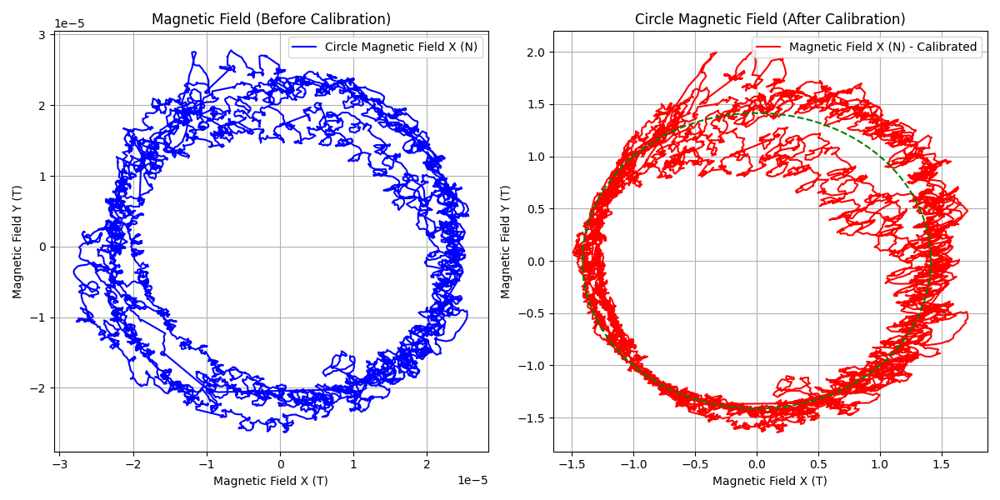
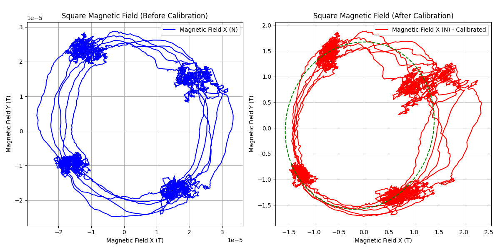

# IMU-Calibration-And-Analysis
This is a IMU Calibration and analysis package. The data is collected using VN-100 IMU/AHRS

---
## The File Structure

### imu/analysis
This folder contains the code for the analysis of the IMU data.
### imu/analysis/output
This folder contains the output files of the analysis.
### imu/Report and Analysis
This folder contains the report and analysis of the assignment.
### imu/data
This folder contains the ROS bag file of the imu data published as ros topic imu.

---

## Results

Hard and Soft Iron Calibration:
Circle Walking Data:



Square Walking Data:



For more Detailed results refer to [IMU Analysis](analysis/Report%20and%20Analysis/Report.pdf)


### Running the analysis scripts

To run the analysis scripts, navigate to the `analysis` folder and run the following commands:

#### One the terminal from the analysis folder and run all the analysis scripts

To run the entire imu analysis

```bash
python3 analysis.py
```

---